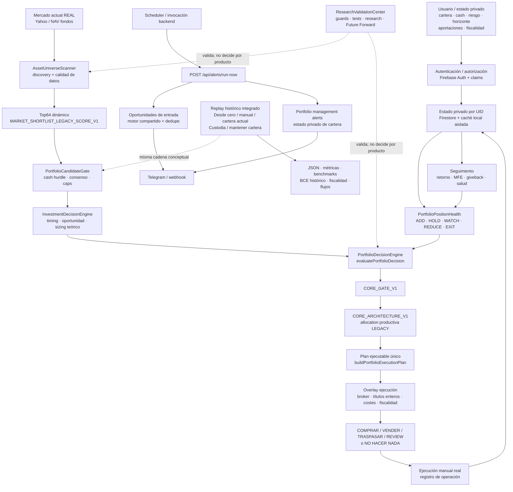

# APP TRADING — FLUJO MAESTRO Y ROADMAP DE CIERRE

Estado: **CANÓNICO PARA ORGANIZACIÓN DEL TRABAJO**  
Fecha base: **2026-09-11**  
Repositorio: `fmaranis/Trading`  
Rama: `main`

Este documento organiza la aplicación y la ruta de cierre del proyecto. No sustituye al código ni a `PROJECT_STATE.md`; ambos deben mantenerse coherentes con este mapa.

Si existe conflicto, prevalece:

1. `fmaranis/Trading/main`;
2. HEAD actual;
3. `PROJECT_STATE.md`;
4. este documento;
5. chats y resúmenes históricos.

---

## 1. Objetivo final del producto

La app debe responder de forma integrada, utilizando una única cadena de decisión:

- qué hacer hoy;
- qué activo comprar, mantener, reducir o vender;
- qué importe asignar;
- por qué;
- cómo está la cartera;
- qué oportunidades existen;
- qué riesgo existe;
- cómo ejecutar la decisión teniendo en cuenta cash, títulos enteros, broker, costes y fiscalidad;
- cómo registrar y seguir la operación real;
- cómo habría actuado históricamente la misma arquitectura de forma causal;
- cómo continuar funcionando de forma privada y persistente aunque el navegador concreto del usuario no sea la única fuente de estado.

La app **no** debe evolucionar hacia una colección de motores, pantallas, replays o investigaciones independientes.

---

## 2. Invariantes que no se pueden romper

- Arquitectura productiva: `CORE_ARCHITECTURE_V1`.
- Una sola cadena productiva desde discovery hasta ejecución y seguimiento.
- Producción mantiene allocation/opportunity `LEGACY` hasta evidencia fresh suficiente.
- `CORE_ELIGIBILITY_V2` permanece shadow.
- Forward Risk no modifica producción en su estado actual.
- Los jobs research no crean una segunda recomendación productiva.
- Replays largos se ejecutan en el motor local/backend de la app, nunca en GitHub Actions.
- Guards, unit tests y TypeScript deben pasar antes de cálculos largos.
- Procedencia siempre explícita: `REAL / STATIC_REFERENCE / SYNTHETIC`.
- Una validación REAL falla si aparece información sintética.
- Replay causal y ejecución posterior a señal; `NEXT_OPEN` cuando corresponde.
- `DAILY/WEEKLY/MONTHLY/QUARTERLY` = frecuencia de revisión, no aportaciones.
- `stagedCapitalPlan` = capital ya disponible, no dinero recurrente.
- Aportaciones/retiradas = `externalCashFlows` explícitos y fechados.
- No retunear una política después de ver el resultado en la misma muestra.
- Una muestra usada para diseñar/interpretar una política queda consumida para promoción.
- No crear un nuevo apartado, job, motor o replay si la capacidad cabe en un flujo existente.

---

# 3. Diagrama maestro de la aplicación



La lectura funcional es:

1. **DÓNDE** — discovery current/live + Top64 dinámico.
2. **CUÁNDO** — gates, consenso y timing.
3. **CUÁNTO** — portfolio decision + allocator + límites.
4. **POR QUÉ / CÓMO EJECUTAR** — evidencia, plan ejecutable, costes, broker, fiscalidad y seguimiento.

`NO HACER NADA` sigue siendo una respuesta válida.

---

# 4. Flujo productivo actual

```text
mercado REAL actual
→ AssetUniverseScanner
→ Top64 dinámico
→ PortfolioCandidateGate
→ InvestmentDecisionEngine
→ PortfolioDecisionEngine / evaluatePortfolioDecision
→ CORE_GATE_V1
→ CORE_ARCHITECTURE_V1
→ buildPortfolioExecutionPlan
→ applyTaxAwareExecutionOverlay
→ COMPRAR / VENDER / TRASPASAR / REVIEW / NO HACER NADA
→ ejecución manual
→ registro
→ seguimiento de cartera
```

Regla: una tarjeta o panel secundario puede mostrar evidencia, pero no puede recalcular una decisión productiva diferente.

---

# 5. Replay histórico integrado

El replay no es otro motor. Reproduce causalmente la misma arquitectura conceptual con las limitaciones de datos históricos.

```text
estado inicial
  ├─ Desde cero
  ├─ Manual
  └─ Mi cartera actual
        ↓
política
  ├─ Motor Custodia
  └─ Mantener cartera
        ↓
frecuencia DAILY / WEEKLY / MONTHLY / QUARTERLY
        ↓
datos disponibles hasta decisionDate
        ↓
misma cadena conceptual de decisión
        ↓
ejecución posterior a señal / NEXT_OPEN
        ↓
BCE histórico + fiscalidad + externalCashFlows
        ↓
JSON + métricas + benchmarks + auditoría
```

Limitación conocida: Yahoo current discovery no reconstruye el universo histórico point-in-time. Sigue existiendo survivorship mientras no haya instrument master histórico con listings/delistings.

---

# 6. Research y validación: papel correcto

`ResearchValidationCenter` sirve para guards, unit tests, TypeScript, diagnósticos current/live, replays integrados, Future Forward e investigación causal.

No debe convertirse en una colección ilimitada de botones por cada activo o hipótesis. Al cerrar una investigación, su estado pasa a `ARCHIVED / RETIRED / CONSUMED` según proceda.

Separación metodológica obligatoria:

```text
calidad de señal ≠ calidad de política económica
```

Una señal predictiva útil no queda invalidada porque una forma concreta de monetizarla falle.

---

# 7. Persistencia, usuarios y seguridad

Esta capa forma parte del cierre del producto y no debe confundirse con la lógica financiera.

Implementado/documentado:

- Firebase Authentication por email/password;
- verificación server-side del Firebase ID token;
- Firebase Admin SDK para administración;
- custom claims `accessGranted` e `isAdmin`;
- Firestore privado por `uid`;
- reglas deny-by-default;
- aislamiento de cartera/efectivo/fiscalidad/historial entre usuarios;
- migración segura de estado local preexistente;
- panel ADMIN para alta, acceso, bloqueo, roles, reset y borrado;
- persistencia durable del deduplicado de alertas en Firestore;
- validación manual multiusuario ya realizada.

Antes de considerar publicación operativa cerrada sigue siendo obligatorio verificar el checklist de `docs/PRIVATE_USERS_DEPLOYMENT.md` en el entorno desplegado.

---

# 8. Alertas y autonomía 24/7

## 8.1 Entradas

Existe flujo backend para oportunidades de entrada y deduplicado durable:

```text
scheduler
→ POST /api/alerts/run-now
→ motor existente de oportunidades
→ Firestore dedupe
→ Telegram / webhook
```

No se duplica ninguna regla de trading en el canal de notificación.

## 8.2 Gestión de cartera

La revisión del HEAD real confirma que **ya existe una primera implementación backend**, `runPortfolioManagementAlerts(...)`, que:

- trabaja con un UID configurado mediante `ALERT_PORTFOLIO_UID` o un único bootstrap admin UID;
- verifica que la cuenta esté activa/autorizada;
- lee `users/{uid}/private/state` de Firestore;
- reconstruye cartera, historial, lotes fiscales y cash benchmark;
- ejecuta `PortfolioPositionHealthService` y el clasificador compartido;
- mantiene dedupe por UID en `users/{uid}/private/portfolioAlertAutomation`;
- puede enviar eventos `ADD / WATCH / REDUCE / EXIT` por Telegram.

Por tanto, el problema no es ya “crear desde cero alertas de salida”. Lo que falta para cerrar autonomía productiva robusta es:

1. sustituir la selección de **un único UID configurado** por enumeración segura de todos los usuarios `ACTIVE`/autorizados que deban recibir avisos;
2. conservar estado/dedupe independiente por UID;
3. revisar que el backend no emita como acción productiva una cadena paralela: actualmente también consulta `PortfolioRotationReviewEngine`; antes de cierre V1 debe quedar alineado con la misma fuente canónica que la superficie productiva;
4. añadir guard/test específico de este flujo backend multiusuario/canónico;
5. verificar scheduler + Firestore + Telegram end-to-end en el despliegue real.

Regla: no se crea una segunda lógica de trading backend.

---

# 9. Estado consolidado de bloques

| Bloque | Estado | Decisión actual |
|---|---|---|
| Cadena productiva única | **DONE** | `CORE_ARCHITECTURE_V1` |
| Acción productiva + plan ejecutable únicos | **DONE** | Sin cadenas paralelas |
| Capital cero real | **DONE** | No se inventa dinero |
| Data provenance | **DONE** | REAL / STATIC_REFERENCE / SYNTHETIC |
| Replay causal integrado | **DONE** | `NEXT_OPEN`, modos integrados |
| Cash BCE + fiscalidad | **DONE** | Causal |
| External cash flows | **DONE / CONSUMED** | Integración PASS |
| Discovery current/live | **DONE** | Yahoo + seed/fallback |
| Top64 dinámico | **DONE / PASS** | No whitelist fija |
| Allocation productiva | **DONE** | `LEGACY` |
| QUALITY allocation | **VALIDATING** | Future Forward 1/12; no promoción |
| `CORE_ELIGIBILITY_V2` | **SHADOW** | No productivo |
| Forward Risk V8 | **RESEARCH RETAINED** | Señal útil; política no resuelta |
| V9 / V10 / V11 | **RETIRED** | No retunear |
| HFG | **CONSUMED / CLOSED** | Diagnóstico, no tuning |
| Identidad `DYNAMIC_*` / `OPEN_*` | **DONE / REAL REPLAY VERIFIED** | Acciones no heredan core |
| Móvil + JSON | **DONE / PASS** | Prueba física realizada |
| Usuarios privados / ADMIN / Firestore | **IMPLEMENTED + MANUAL MULTIUSER PASS** | Falta cierre de checklist de publicación |
| Alertas de entrada persistentes | **IMPLEMENTED** | Cierre end-to-end de despliegue pendiente si no está ya operativo |
| Alertas de cartera backend | **PARTIAL / SINGLE-UID IMPLEMENTED** | Salud + Telegram existen; multiusuario + alineación canónica pendientes |
| Broker API automática | **NOT IMPLEMENTED / FUTURE** | Ejecución manual asistida |
| Instrument master histórico point-in-time | **NOT IMPLEMENTED** | Survivorship reconocido |
| USD/Nasdaq/NYSE + FX | **DEFERRED** | Después del cierre V1 |
| Listings jóvenes / IPO / fundamentales / revisiones / volumen | **DEFERRED** | Después del cierre V1 |
| RL / FinRL | **DEFERRED** | Complejidad no justificada |

---

# 10. Ruta maestra para finalizar la aplicación

Estados: `DONE`, `ACTIVE`, `WAITING`, `NEXT`, `DEFERRED`, `RETIRED`.

## FASE 0 — MAPA MAESTRO Y ESTADO CANÓNICO

**Estado: ACTIVE → pendiente de revisión/aceptación del usuario.**

Entregables:

- este documento;
- `PROJECT_STATE.md` actualizado al HEAD real;
- README alineado con la arquitectura actual;
- HFG cerrado como diagnóstico consumido;
- ruta completa ordenada por prioridad;
- ningún nuevo panel/job/motor.

Criterio DONE: un chat futuro reconstruye qué hace la app, qué está cerrado y cuál es el siguiente paso leyendo `PROJECT_STATE.md` + este documento.

## FASE 1 — CONGELAR BASE PRODUCTIVA V1

**Estado: DONE salvo regresión material.**

Incluye una sola decisión productiva, una sola ejecución, salud de posiciones, broker availability, fiscalidad, cash, móvil/export, replay integrado, identidad correcta de acciones dinámicas y quick closure PASS.

No repetir `Producto · cierre rápido` salvo cambio material posterior.

## FASE 2 — CIERRE OPERATIVO / DESPLIEGUE / AUTONOMÍA

**Prioridad: MUY ALTA. Estado: NEXT.**

### 2A. Publicación segura

Auditar y cerrar el checklist de `docs/PRIVATE_USERS_DEPLOYMENT.md` en el entorno real:

- Firebase/Auth/Firestore/configuración;
- reglas desplegadas;
- ADMIN y usuario normal;
- fail-closed;
- aislamiento multiusuario;
- persistencia `FIRESTORE`;
- servicio persistente;
- scheduler real probado.

### 2B. Autonomía de alertas

Partir del `runPortfolioManagementAlerts` existente, no crear otro sistema:

- generalizar de un UID configurado a usuarios activos autorizados;
- mantener dedupe independiente por UID;
- alinear cualquier alerta accionable con la cadena productiva canónica y revisar el uso residual de `PortfolioRotationReviewEngine`;
- añadir guards/tests del flujo backend;
- confirmar alertas de entrada y cartera end-to-end;
- no introducir ejecución automática de órdenes.

Criterio DONE: la app puede mantenerse operativa y avisar de eventos relevantes sin depender de que un navegador concreto esté abierto, conservando privacidad y la misma lógica canónica.

## FASE 3 — PROTOCOLO ECONÓMICO FINAL

**Prioridad: MUY ALTA. Estado: NEXT tras Fase 2; puede prepararse documentalmente sin abrir muestras.**

Antes de nuevas políticas:

- métricas PASS/FAIL;
- definición de muestra fresh/blind/OOS;
- registro de ventanas consumidas;
- benchmarks comparables;
- costes/fiscalidad y materialidad;
- política congelada antes de abrir resultados.

## FASE 4 — REENTRADA DESPUÉS DE UNA SALIDA ERRÓNEA

**Prioridad: ALTA. Estado: NEXT research.**

HFG sólo aporta diagnóstico consumido: `EXIT temprano → recuperación → oportunidad posterior → timing/capital pueden impedir reentrada`.

Objetivo fresh: distinguir fallo de señal, timing y financiación; diseñar hipótesis general sin thresholds derivados de HFG; congelarla y validarla en activos/ventanas nuevas.

## FASE 5 — PROTECCIÓN DE GRANDES GANADORES

**Prioridad: ALTA. Estado: NEXT research.**

HFG mostró que `TREND_PROTECTION_V1` detectó deterioro antes del EXIT económico, pero esa muestra no puede fijar ahora una política ejecutiva.

Diseñar previamente una política de monetización, separar detección de ejecución y validar fresh/OOS. No convertir retrospectivamente el `REDUCE 50%` visto en HFG en política productiva.

## FASE 6 — FORWARD RISK V8 COMO INFORMACIÓN DE CONTEXTO

**Prioridad: MEDIA-ALTA. Estado: FUTURE RESEARCH.**

V8 mantiene valor predictivo de downside. V9/V10/V11 fallaron como políticas económicas.

Usos admisibles bajo protocolo nuevo: contexto de riesgo, sizing, ranking/priorización, alertas, stress o margen de seguridad. No crear V12/V13 como simple cambio retrospectivo de thresholds.

## FASE 7 — QUALITY FUTURE FORWARD

**Estado: WAITING / COLLECTING EN PARALELO.**

`QUALITY_ALLOCATION_DYNAMIC_FUTURE_FORWARD_V1`:

- 1/12 observaciones;
- 0 outcomes maduros a 2026-09-11;
- producción `LEGACY`;
- 25 archivos metodológicos congelados;
- siguiente observación nueva: **2026-10-09 22:30–24:00 Europe/Madrid**.

Avanza por calendario y no bloquea Fases 2–6, siempre que no se modifiquen sus fuentes congeladas.

## FASE 8 — UNIVERSO HISTÓRICO POINT-IN-TIME

**Prioridad: ALTA PARA VALIDACIÓN DEFINITIVA.**

Objetivo: instrument master histórico con listings, delistings, cambios de ticker/mercado y disponibilidad por fecha para reducir survivorship.

## FASE 9 — AUDITORÍA END-TO-END Y CIERRE V1

Revisar producto current/live, seguridad/persistencia, replay causal, regímenes de mercado, cartera desde cero/manual/actual, cash/flujos, costes/fiscalidad, benchmarks, alertas y límites de evidencia económica.

Salida: capacidades productivas definitivas, políticas promovidas/rechazadas, limitaciones explícitas y deuda mínima V2.

## FASE 10 — EXPANSIONES V2

**Estado: DEFERRED.**

Sólo después del cierre V1: USD/Nasdaq/NYSE con FX, listings jóvenes/IPO, fundamentales, revisiones de beneficios, volumen avanzado, taxonomía sectorial robusta, proveedor de universo más exhaustivo, broker API/ejecución automática si se justifica y RL/FinRL sólo si la complejidad aporta valor.

---

# 11. Carriles paralelos para no mezclar trabajo

```text
CARRIL A — PRODUCTO / OPERACIÓN
Fase 0 → Fase 1 → Fase 2 → Fase 9

CARRIL B — EVIDENCIA ECONÓMICA
Fase 3 → Fase 4 → Fase 5 → Fase 6 → Fase 9

CARRIL C — PROSPECTIVO POR CALENDARIO
Fase 7 (QUALITY Future Forward, sin tocar congelados)

CARRIL D — CALIDAD DE DATOS HISTÓRICOS
Fase 8 → Fase 9

CARRIL E — V2
Fase 10 únicamente después del cierre V1
```

Regla de control: una idea descubierta en una fase no abre inmediatamente otra implementación. Primero se clasifica como `BUG`, `HYPOTHESIS`, `DEFERRED` o `RETIRED`, se actualiza el roadmap y después se decide si entra en la secuencia.

---

# 12. Qué NO es trabajo pendiente

No deben reaparecer como tareas abiertas:

- V9/V10/V11 en sus formas probadas;
- SLOPE_V1;
- QUALITY_V1 retrospectivo;
- QUALITY_ALLOCATION_BRIDGE_V1 retrospectivo;
- HFG como muestra de promoción;
- antiguos motores/pantallas productivos duplicados;
- replays independientes por variante;
- nuevos jobs por activo concreto;
- retuning de Top64/Opportunity con snapshots ya observados;
- V12/V13 como parameter chasing.

---

# 13. Siguiente paso operativo al cerrar este documento

Una vez Fase 0 quede revisada y aceptada:

1. mantener Fase 1 congelada salvo regresión;
2. entrar en **Fase 2 — cierre operativo/despliegue/autonomía**;
3. auditar primero el backend existente de alertas de cartera antes de escribir código nuevo;
4. preparar documentalmente Fase 3 sin abrir aún muestras nuevas;
5. no tocar Future Forward salvo en su próxima ventana válida;
6. no abrir Fases 4–6 hasta que exista protocolo económico congelado.

La ruta debe permanecer visible también en `PROJECT_STATE.md`.